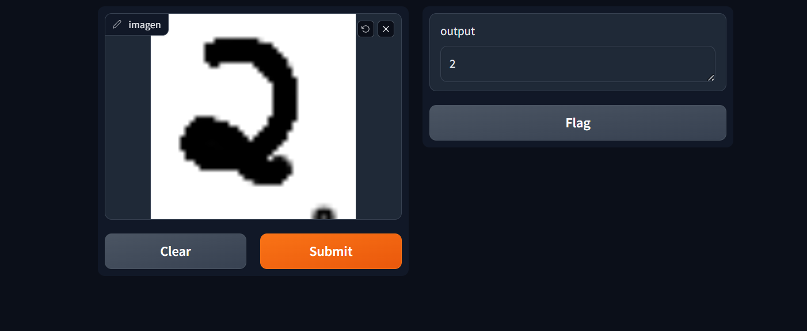

# Neural Network Prediction Model

This repository contains a neural network-based prediction model created using the MNIST dataset. The model is trained to recognize handwritten digits and can predict the input number provided by the user.

## Features

- **Neural Network Model**: Trained using the MNIST dataset to recognize digits from 0 to 9.
- **Visualization with Netron**: The model's architecture can be visualized using the Netron library.
- **Interactive Prediction Tool**: A local prediction tool created using Gradio to provide an easy-to-use interface for users to input and predict digits.

## Model Architecture

The model architecture is visualized using Netron. 
Below is an example of the visualization:

## Interactive Prediction Tool

The local prediction tool is built using Gradio, allowing users to input handwritten digits and receive predictions from the trained model. 
Below is an example of the tool's interface:

